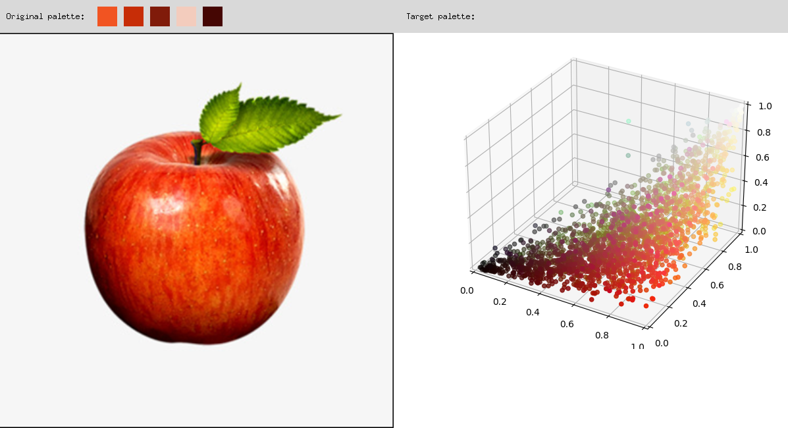
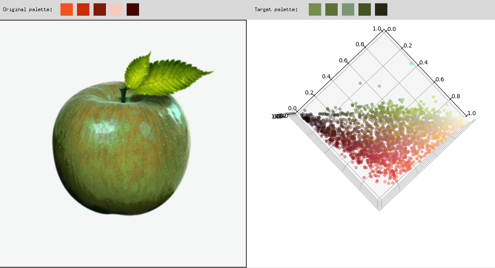

# Towards-Natural-Object-based-Image-Recoloring

  

This repository includes the implementation of our work: 

**Towards Natural Object-based Image Recoloring**

## Installation
Our code has been tested on Python 3.7, Ubuntu 18, CUDA 10.0. Please follow the instructions to configure your environment.

    conda create -n recolor python=3.7 -y
    conda activate recolor
    conda install pytorch cudatoolkit=10.0 torchvision -c pytorch
    pip install mmcv-full
    pip install -r requirements/build.txt
    pip install -v -e . 
    pip install opencv-python

## A Quick Demo
Run the following command for a quick demonstration of our work.

    python GUI.py
    
Click the right mouse button to select a palette.

  
  

